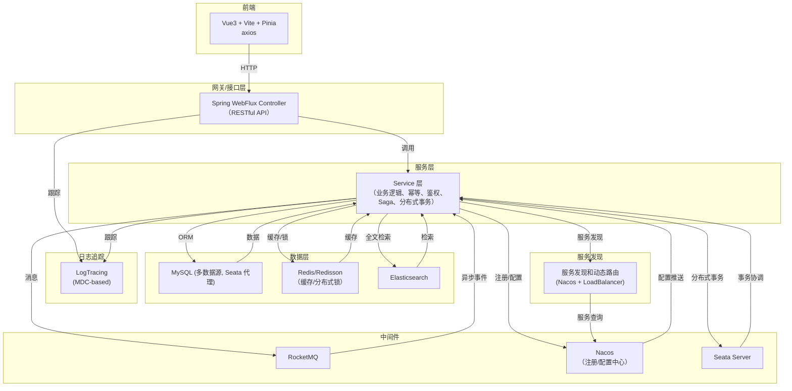

# BGAI 智能服务平台

## 项目简介

BGAI 是一套基于 Spring Boot 3、Spring Cloud Alibaba、Seata、MyBatis-Plus、RocketMQ、Elasticsearch、Redis/Redisson、Pinia+Vue3 的企业级智能 AI 服务平台。支持多数据源、分布式事务、微服务注册与配置、消息队列、缓存、全文检索等能力，前后端分离，支持高并发与高可用。

---

## 技术架构图



---

## 技术栈

### 后端

- **Spring Boot 3.2.x**
- **Spring Cloud 2023.x** + **Spring Cloud Alibaba**
- **Seata**（分布式事务）
- **MyBatis-Plus**（高效 ORM）
- **Druid**（多数据源、SQL监控）
- **RocketMQ**（消息队列）
- **Elasticsearch**（全文检索）
- **Redis/Redisson**（缓存/分布式锁）
- **Caffeine**（本地缓存）
- **Nacos**（注册中心/配置中心）
- **Log Tracing**（基于 MDC 的分布式日志追踪）
- **动态路由**（基于 Nacos 的服务发现和负载均衡）

### 前端

- **Vue 3**
- **Vite**
- **Pinia**（状态管理）
- **Vue Router**
- **Axios**
- **ESLint**

---

## 目录结构

```
bgai/
├── src/
│   ├── main/
│   │   ├── java/com/bgpay/bgai/    # 后端主代码
│   │   └── resources/              # 配置、SQL、Saga、Mapper等
│   └── test/                       # 后端测试
├── frontend/                       # 前端 Vue3 + Vite + Pinia
├── Dockerfile*                     # 多种 Docker 构建方案
├── docker-compose.yml              # 一键启动依赖服务
├── README.md                       # 项目说明
└── ...                             # 其他脚本、文档、工具
```

---

## 快速启动

### 1. 环境准备

- JDK 21
- Maven 3.8+
- Node.js 18+
- Docker & Docker Compose

### 2. 启动依赖服务

```bash
docker-compose up -d
```
> 包含 MySQL、Redis、Nacos、RocketMQ、Elasticsearch、Seata-Server 等

### 3. 启动后端

```bash
./mvnw clean package -DskipTests
java -jar target/bgai-0.0.1-SNAPSHOT.jar
# 或
./start.sh
```

### 4. 启动前端

```bash
cd frontend
npm install
npm run dev
```
访问：http://localhost:5173

---

## 主要功能

- 多数据源动态路由
- 分布式事务（Seata 自动代理）
- 微服务注册/配置（Nacos）
- 消息队列（RocketMQ）
- 缓存/分布式锁（Redis/Redisson/Caffeine）
- 全文检索（Elasticsearch）
- Saga 状态机
- 前后端分离
- 分布式日志追踪（基于 MDC 的 traceId 和 userId 追踪）
- 动态服务发现和路由（基于 Nacos 的服务发现和负载均衡）
- 丰富的脚本和 Docker 支持

---

## 重要约定与最佳实践

- 数据源代理：所有物理数据源由 Seata 自动代理，dynamicDataSource 只做路由。
- 分布式事务：只需在业务方法上加 `@GlobalTransactional`。
- 配置管理：所有环境变量、数据库连接、MQ等均可通过 Nacos 配置中心集中管理。
- 前端开发：推荐使用 VSCode + Volar 插件。
- 日志追踪：所有请求会自动分配 traceId，可通过日志追踪完整调用链路。
- 服务调用：使用动态路由工具类进行微服务间通信，支持同步和响应式调用方式。

---

## 日志追踪系统

系统集成了基于 MDC 的分布式日志追踪功能：

- 每个请求自动分配唯一 traceId
- 自动关联用户 userId（如果已认证）
- 支持 WebMvc 和 WebFlux 两种 Web 框架
- 日志格式包含 traceId 和 userId，便于问题排查
- 与 Logstash 集成，支持集中式日志分析

使用示例：
```java
// 不需要手动设置 traceId，拦截器会自动处理
// 但如有需要，可以手动获取当前 trace 信息
String traceId = LogUtils.getTraceId();
String userId = LogUtils.getUserId();

// 记录业务日志时会自动包含追踪信息
logger.info("业务操作完成");
```

---

## 服务发现和动态路由

系统集成了基于 Nacos 的服务发现和动态路由功能：

- 支持服务自动注册到 Nacos 注册中心
- 支持基于服务名的负载均衡调用（无需硬编码 IP/端口）
- 同时支持响应式（WebClient）和传统（RestTemplate）两种调用方式
- 提供统一的 ServiceDiscoveryUtils 工具类简化服务调用

### 使用示例：

#### 响应式调用（WebClient）

```java
// 注入工具类
@Autowired
private ServiceDiscoveryUtils serviceDiscoveryUtils;

// 调用远程服务（使用服务名）
Mono<UserDto> userMono = serviceDiscoveryUtils.callService(
    "user-service",          // 服务名
    "/api/users/123",        // 接口路径
    HttpMethod.GET,          // HTTP方法
    null,                    // 请求体（GET请求为null）
    UserDto.class            // 响应类型
);
```

#### 同步调用（RestTemplate）

```java
// 注入工具类
@Autowired
private ServiceDiscoveryUtils serviceDiscoveryUtils;

// 同步调用远程服务
UserDto user = serviceDiscoveryUtils.callServiceSync(
    "user-service",          // 服务名
    "/api/users/123",        // 接口路径
    HttpMethod.GET,          // HTTP方法
    null,                    // 请求体（GET请求为null）
    UserDto.class            // 响应类型
);
```

#### 获取服务信息

```java
// 获取指定服务的所有实例
List<ServiceInstance> instances = serviceDiscoveryUtils.getServiceInstances("user-service");

// 获取指定服务的一个实例（负载均衡）
Optional<ServiceInstance> instance = serviceDiscoveryUtils.getServiceInstance("user-service");

// 构建完整的服务URL
String serviceUrl = serviceDiscoveryUtils.buildServiceUrl("user-service", "/api/endpoint");
```

---

## 常见问题

- 分布式事务不生效/报 DataSourceProxy 错：不要自定义 Seata ResourceManager，全部交由 Seata 官方自动注册。
- Nacos/Seata/Redis/ES 启动失败：检查端口冲突、内存限制、配置文件路径。
- 前端无法访问后端接口：检查后端端口、CORS 配置、Nginx 代理设置。

---

## 贡献与协作

1. Fork 本仓库，创建 feature 分支
2. 提交 PR，描述变更内容
3. 代码需通过 CI 检查和单元测试

---

## 联系与支持

- 技术支持：请提 Issue 或联系项目维护者
- 文档完善、Bug 反馈、Feature 需求欢迎随时提交

---

**Enjoy BGAI！让智能服务更简单！**